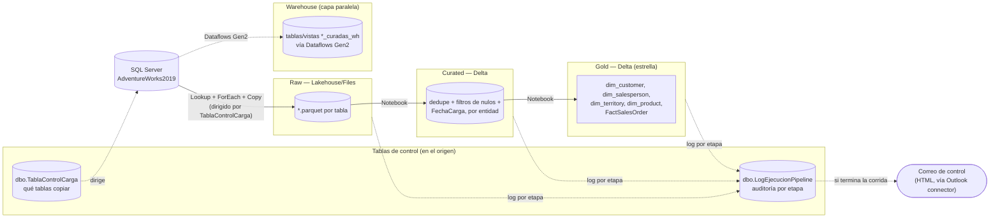

# AdventureWorks en Microsoft Fabric

Pipeline de datos end-to-end sobre **AdventureWorks2019** (SQL Server) implementado
100% en **Microsoft Fabric**: Data Pipelines (estilo ADF) para ingesta y
orquestación, Notebooks de Spark para las transformaciones, un **Lakehouse** como
zona Raw/Curated/Gold, y un **Warehouse** SQL como capa de consumo adicional.

A diferencia de un pipeline armado a mano tabla por tabla, la ingesta cruda es
**metadata-driven**: una tabla de control en la base origen decide qué se copia, y
un pipeline "padre" orquesta las tres etapas (Raw → Silver/Curated → Gold) con
logging de ejecución y notificación por correo en cada corrida.

## 1. Arquitectura



## 2. Los tres patrones de carga

El repo separa explícitamente **tres estrategias de carga**, cada una con su propia
carpeta de Notebooks y de Pipelines — no son variantes de un mismo script, son tres
diseños distintos:

| Carpeta | Patrón | Cómo escribe en destino |
|---|---|---|
| [01_TruncateLoad](AdventureWorksProject/Notebooks/01_TruncateLoad/) | Full / truncate-and-load | `mode("overwrite")` — reemplaza toda la tabla en cada corrida |
| [02_IncrementalLoad](AdventureWorksProject/Notebooks/02_IncrementalLoad/) | Ventana móvil de 14 días | `mode("overwrite").option("replaceWhere", "ModifiedDate >= ...")` — reemplaza solo la partición de los últimos 14 días |
| [03_Reprocess](AdventureWorksProject/Notebooks/03_Reprocess/) | Full Load / Range Load parametrizado | Igual mecánica que arriba, pero con `startDateCarga`/`endDateCarga` (o `IsFullLoad`) recibidos como parámetro del pipeline en vez de hardcodeados |

**Nota técnica honesta:** el patrón incremental de `02_IncrementalLoad` es un
`replaceWhere` sobre una ventana fija de 14 días, no un `MERGE`/upsert real — si un
registro de origen se modifica con una fecha fuera de esa ventana, esta carga no lo
recoge (por diseño quedaría para una corrida de `03_Reprocess`). Es una estrategia
válida y común en Fabric/Synapse cuando el patrón de llegada tardía es acotado, pero
vale la pena saber la diferencia frente a un `DeltaTable.merge()` con claves de
negocio si te preguntan por qué no se usó upsert acá.

### Ingesta Raw — metadata-driven

[Carga_Raw_SQL](AdventureWorksProject/Pipelines/01_TruncateLoad/Carga_Raw_SQL.DataPipeline/)
no tiene una actividad `Copy` por tabla: hace un `Lookup` contra
`dbo.TablaControlCarga` (filtrando `tableType = 'Dim'` o `'Fact'` según el pipeline) y
un `ForEach` que copia cada tabla listada (`schemaName`/`tableName`/`targetFolder`) a
Parquet en el Lakehouse. Agregar una tabla nueva a la ingesta es una fila nueva en esa
tabla de control, no un pipeline nuevo — el mismo principio de "todo es config" que
el resto del proyecto.

### Curated → Gold (Notebooks Spark)

Cada notebook de `01_TruncateLoad`/Curated hace lo mismo por entidad (`Customer`,
`Product`, `ProductCategory`, `ProductSubcategory`, `SalesTerritory`, `SalesPerson`,
`SalesOrderHeader`): `dropDuplicates()`, filtra nulos en la PK, quita columnas
técnicas (`rowguid`, etc.) y agrega `FechaCarga`. Gold arma el modelo:

| Tabla Gold | Fuente(s) Curated |
|---|---|
| `dim_customer` | `Customer_curated` |
| `dim_salesperson` | `SalesPerson_curated` |
| `dim_territory` | `SalesTerritory_curated` |
| `dim_product` *(guardada como `dim_ProductCategory`)* | join `Product` + `ProductSubcategory` + `ProductCategory` |
| `FactSalesOrder` | join `SalesOrderDetail_Curated` + `SalesOrderHeader_curated` |

### Reprocess — Full y Range, con time travel

`03_Reprocess` recibe parámetros del pipeline (`IsFullLoad`, `StartDate`/`EndDate`)
para forzar una recarga completa o por rango de fechas cuando algo salió mal en la
carga incremental normal. El notebook
[RangeLoad_FactGold](AdventureWorksProject/Notebooks/03_Reprocess/RangeLoad_FactGold.Notebook/notebook-content.py)
además deja documentado, en celdas separadas, cómo hacer **rollback con Delta time
travel** (`DeltaTable.history()` + `spark.read.option("versionAsOf", N)` reescrito
sobre la tabla actual) — no es parte del flujo automático, pero es la explicación de
cómo se recuperaría una versión anterior de `FactSalesOrder` si un reproceso salió
mal.

## 3. Orquestación y auditoría

`00_General` (carpeta `01_TruncateLoad`) es el pipeline maestro: invoca
`Pipeline_Padre`, y `Pipeline_Padre` encadena Raw → Curated → Gold vía actividades
**`InvokePipeline`** (pipeline-a-pipeline, no todo en un solo lienzo). Antes/después de
cada etapa hay actividades `Script` que insertan/actualizan filas en
**`dbo.LogEjecucionPipeline`** (en la base origen, no en el Lakehouse) con
`IdEjecucion` (`@pipeline().RunId`), `Etapa` (`RAW`/`SILVER`/`GOLD`), `Estatus`
(`En ejecución`/`Completado`/`Fallido`) y `MensajeError` si la etapa falló — un log de
corridas equivalente en propósito a las tablas `runs`/`ingestions` de un pipeline
Databricks, pero implementado como tabla SQL de control en vez de tabla Delta.

Al cerrar la corrida, un `Lookup` contra un stored procedure
(`SP_ETL_PipelineTableHTML`) arma una tabla HTML con el resultado de esa ejecución, y
una actividad **Office 365 Outlook** envía esa tabla por correo a una lista de
destinatarios de control (definida dentro del pipeline); un último `Script` marca esas
filas como `CorreoEnviado = 1` para no reenviarlas en la siguiente corrida.
`03_Reprocess` replica el mismo patrón de log + correo, solo que invocando el pipeline
de reprocesamiento en vez del de carga normal.

## 4. Capa Warehouse — ruta paralela vía Dataflows Gen2

Aparte de Notebooks + Lakehouse, el repo incluye un
[Warehouse](AdventureWorksProject/Warehouse/Warehouse_AdventureWorks2019.Warehouse/)
con tablas `dbo.*_curadas_wh`/`*_enriquecidas_wh` y vistas encima
(`dbo.clientes_curados`, etc.), poblado por un Dataflow Gen2 (de ahí los lakehouses/
warehouses de staging autogenerados con nombre `StagingXxxForDataflows_<timestamp>`
en la raíz del repo) — es decir, una ruta de bajo código en paralelo a los notebooks
de Spark, útil como comparación de dos formas de resolver lo mismo en Fabric.

**Dicho con la misma honestidad que el resto de esta documentación:** las tablas del
Warehouse están tipadas todo `varchar(8000)` (sin tipado real todavía) y el repo
incluye `my_first_dbt_model.sql`/`my_second_dbt_model.sql` — son el scaffold por
defecto que genera la integración de dbt con Fabric al inicializarse, sin lógica de
negocio propia. Es una exploración de la integración dbt-Warehouse, no una capa
productiva terminada.

## 5. Estructura del repo

```
AdventureWorksProject/
├── LakeHouse/Lakehouse_AdventureWorks2019.Lakehouse/   # Raw/Curated/Gold (Files/*)
├── Notebooks/
│   ├── 01_TruncateLoad/        # full load: Raw→Curated, Curated→Gold
│   ├── 02_IncrementalLoad/     # ventana móvil de 14 días (replaceWhere)
│   └── 03_Reprocess/           # full/range load parametrizado + rollback (time travel)
├── Pipelines/
│   ├── 01_TruncateLoad/        # 00_General (maestro) → Pipeline_Padre → Carga_Raw_SQL + transformaciones
│   ├── 02_IncrementalLoad/     # 00_PlMaster_Inc → Raw_Inc → Silver_Inc → Gold_Inc
│   └── 03_Reprocess/           # 00_General_Reprocess → 01_Reprocess (FullLoad/ y Range/)
└── Warehouse/Warehouse_AdventureWorks2019.Warehouse/   # tablas/vistas *_curadas_wh (Dataflows Gen2 + dbt scaffold)

TestFolder/                      # sandbox: reportes, semantic models y un Lakehouse
                                  # distinto (RetailLakehouse) — exploración, no forma
                                  # parte del pipeline de AdventureWorks
```

## 6. Qué demuestra este proyecto

- Orquestación **metadata-driven** de la ingesta (tabla de control decide qué copiar,
  no un `Copy` por tabla).
- Tres estrategias de carga distintas y conscientes de sus trade-offs (full,
  ventana móvil por partición, reproceso parametrizado) en vez de una sola solución
  forzada para todos los casos.
- Orquestación pipeline-a-pipeline (`InvokePipeline`) con logging de auditoría por
  etapa y notificación automática — no solo "que corra", sino que quede trazado
  quién corrió qué y cuándo.
- Uso de **Delta time travel** como mecanismo de rollback documentado.
- Comparación práctica entre dos formas de resolver lo mismo en Fabric: Notebooks de
  Spark (código) vs. Dataflows Gen2 (bajo código) para la misma fuente de datos.
